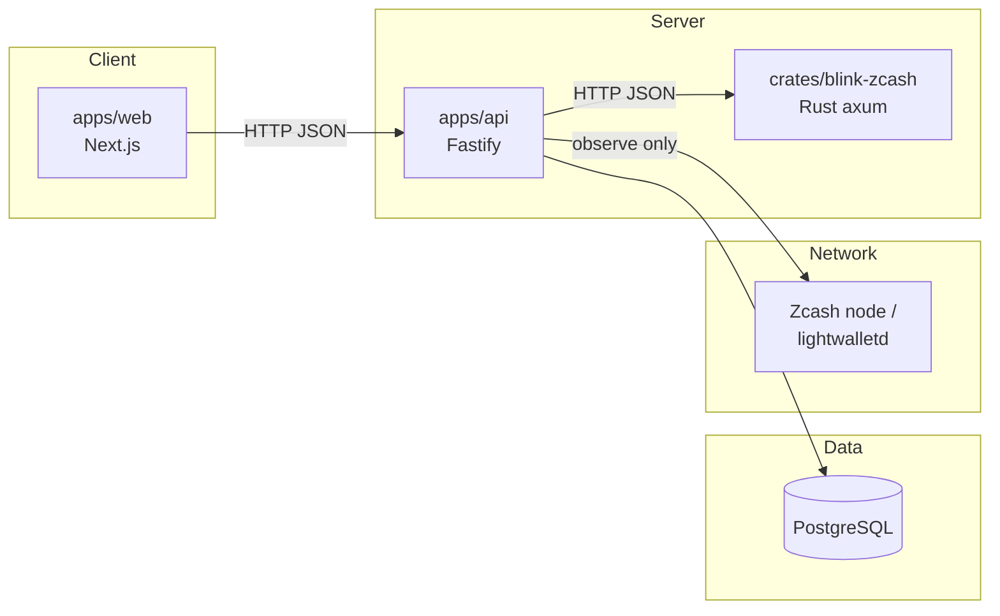
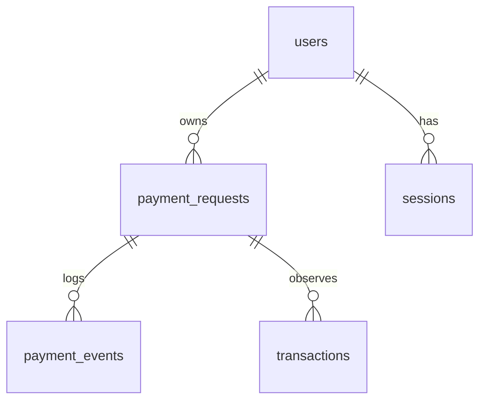

# Architecture

BLINK is a monorepo with a clear separation of concerns: a standards-focused
payment-request core, an authoritative Zcash engine, an API that owns state, and
a web client that owns the experience.

## Components

### `packages/payment-request`

The ZIP 321 core. Pure functions, no I/O.

- `buildZip321Uri` / `buildSinglePaymentUri` — build `zcash:` URIs.
- `parseZip321` / `parseSinglePayment` — parse and validate.
- `base64urlEncode` / `base64urlDecode` — ZIP 321 memo encoding.
- `encodeQchar` / `decodeQchar` — per-parameter escaping rules.

### `packages/zcash`

Address parsing and classification.

- `parseAddress` — returns the address family and network.
- `addressFingerprint` — a truncated hash for display/debugging.
- `InvalidAddressError`.
- Sprout is deliberately **not** a supported family.

### `packages/shared`

Cross-cutting types and rules.

- `ZcashNetwork` (`testnet` | `mainnet`).
- `AddressKind` — transparent / sapling / unified.
- Money math and formatting.
- `PaymentStatus` and the transition table enforced by the API.

### `crates/blink-zcash`

The authoritative engine, built on the **official** Zcash Rust crates
(`zip321`, `zcash_address`, `zcash_protocol`, `zcash_primitives`). Serves address
inspection, URI building, and transaction decoding over HTTP so the TypeScript
API can defer to it. Stateless; no keys, no database.

Transaction decoding is what lets BLINK report a real txid without hashing bytes
by hand: `zcash_primitives` reads the consensus-encoded transaction and yields
the canonical txid (SHA256d for v1–v4, BLAKE2b for v5).

HTTP surface: `GET /health`, `POST /v1/address/inspect`, `POST /v1/zip321/build`,
`POST /v1/zip321/parse`, and `POST /v1/transaction/inspect` (raw hex in,
canonical txid out).

### `apps/api`

Fastify service that owns request state.

- Creates and stores payment requests (address encrypted at rest).
- Owns short codes, events, idempotency and the state machine.
- Delegates authoritative validation to the Rust engine.
- Runs the verification layer, which is the only writer of blockchain-derived
  fields.

### Verification layer

`apps/api/src/services/verification-provider.ts` is the only path by which
blockchain-derived state enters the database. It can only observe; it cannot
create, sign or broadcast anything, and it returns either what it saw or `null` —
never a synthesized transaction.

The `lightwalletd` provider:

1. Refuses unless it can reach a configured `blink-zcash` engine (needed to
   decode transactions authoritatively) and the requested network matches its
   own.
2. Calls `GetLightdInfo` and rejects an endpoint serving the wrong chain.
3. Calls `GetTransaction` with the claimed txid in little-endian byte order.
4. Decodes the returned bytes with the engine and accepts the observation only if
   the derived txid matches the claim. This binds the reported bytes to the
   claimed id, so a payer cannot point BLINK at an unrelated transaction.
5. Computes confirmations from `GetLatestBlock` (tip − mined height + 1), treating
   the off-chain sentinel height as zero confirmations.

Any failure at any step yields `null`; the payment stays `UNKNOWN` / unconfirmed.

### `apps/web`

Next.js 15 + React 19 client. Home, request, pay, confirmation, status, activity
and receipt screens. QR codes encode the ZIP 321 URI itself.

## Data model

- `payment_requests` holds user-supplied metadata and the encrypted recipient
  address.
- `transactions` holds blockchain-observed state, written only by the verification
  layer.
- `payment_events` is an append-only log.

The split between `payment_requests` and `transactions` is what makes it
impossible for a client to forge a confirmation.

## Request lifecycle (API surface)

| Method | Path | Purpose |
| --- | --- | --- |
| `GET` | `/health` | Liveness: service, network and provider status. Never checks dependencies |
| `GET` | `/ready` | Readiness: 200 `ready` once the database and the Rust engine answer, else 503 `starting`. An operational probe (Render, keep-warm), not a browser call |
| `POST` | `/v1/payment-requests` | Create a request |
| `GET` | `/v1/payment-requests/:shortCode` | Public view (no raw address) |
| `GET` | `/v1/payment-requests/:shortCode/payment-details` | Amount/recipient/memo for the payer |
| `POST` | `/v1/payment-requests/:shortCode/initiate` | Mark payment initiated |
| `POST` | `/v1/payment-requests/:shortCode/transactions` | Report a claimed txid |
| `POST` | `/v1/payment-requests/:shortCode/verify` | Run the verification layer |
| `POST` | `/v1/payment-requests/:shortCode/cancel` | Cancel (management token required) |
| `GET` | `/v1/payment-requests/:shortCode/receipt` | Receipt, only if confirmed |
| `GET` | `/v1/activity` | Recent requests |
| `GET` | `/v1/meta/expiry-options` | Allowed expiry values |
